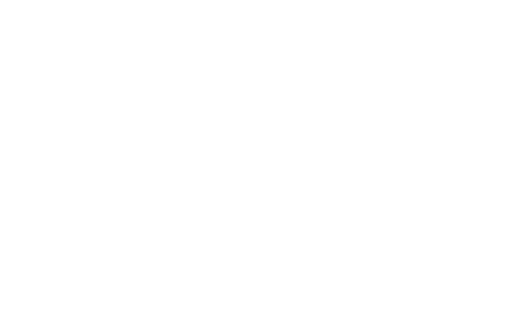

<!-- Improved compatibility of back to top link: See: https://github.com/othneildrew/Best-README-Template/pull/73 -->

<!--
*** Thanks for checking out the Best-README-Template. If you have a suggestion
*** that would make this better, please fork the repo and create a pull request
*** or simply open an issue with the tag "enhancement".
*** Don't forget to give the project a star!
*** Thanks again! Now go create something AMAZING! :D
-->

<!-- PROJECT LOGO -->
 

  

<!-- ABOUT THE PROJECT -->

## About The Project

### Welcome to the Seamless Smart Home Project!

Inside this collection of repositories, you'll find the configuration for my home automation system, along with documentation, blog posts, and some strongly opinionated ideas about how to achieve a similar setup in your own project. The name Seamless Smart Home comes from a principle that has stuck with me since I read a blog post many years ago that explained the principles behind Home Assistant. In short, any automation inside the home must be "wife-approved," meaning it should be seamless for anyone to use without having to think about the automation, know specific voice commands, download an app, or interact with a dashboard.

### Built With

- Home Assistant
- Homebridge
- Frigate
- CompreFace
- Double Take

<!-- GETTING STARTED -->

## Getting Started

This is an example of how you may give instructions on setting up your project locally.
To get a local copy up and running follow these simple example steps.

<!-- ACKNOWLEDGMENTS -->

## Acknowledgments

- 
- 
- 
